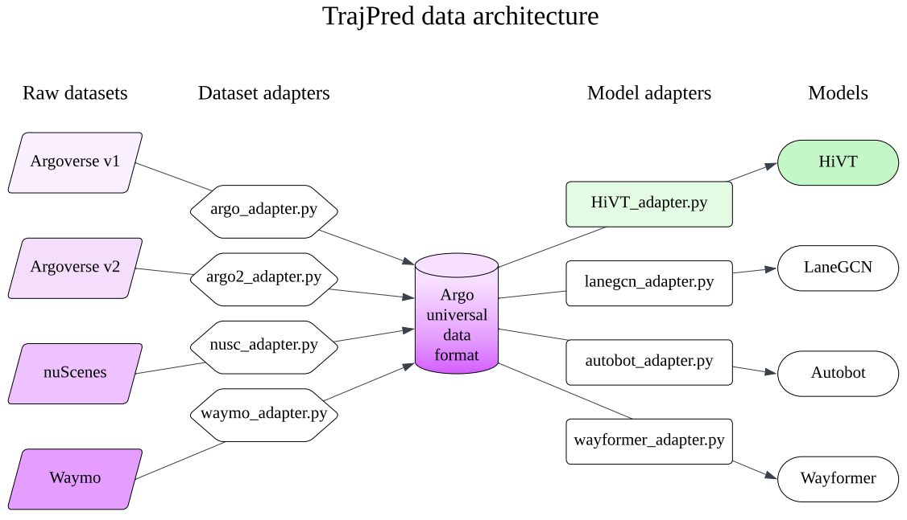
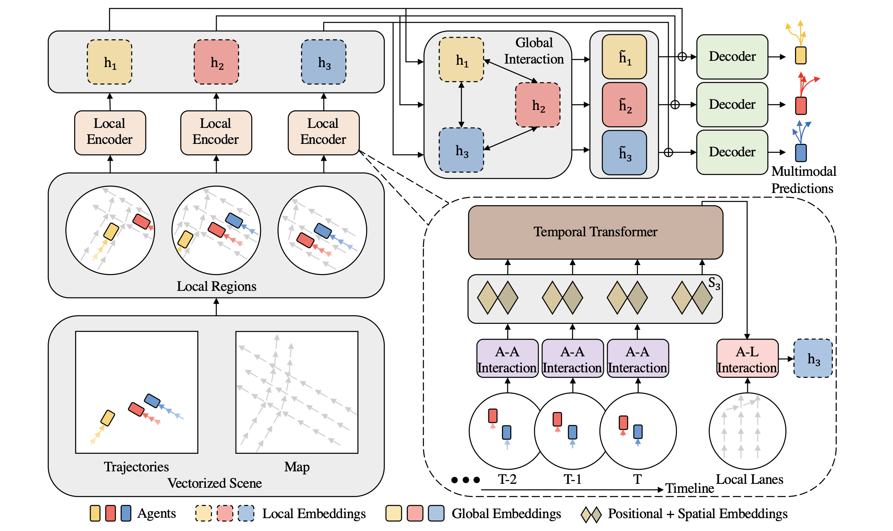

# CIVIL 459: Project
<hr style="clear:both">
This repository contains our contribution to the TrajPred framework from VITA. It was done as part of the Deep Learning for Autonomous Vehicle course at EPFL

**Authors:** \
[Anne-Valérie Preto](mailto:anne-valerie.preto@epfl.ch)\
[Victor Dubien](mailto:victor.dubien@epfl.ch)
<hr style="clear:both">

## Contribution Overview

### Framework TrajPred
The main aim of the framework is to be able to combine several datasets in a model. To create a robust model, it is important to have a wide range of interesting scenarios where current forecasting struggles to make good predictions.
Using datasets from Argoverse, Argoverse V2, Waymo and nuScenes, it is possible to dilute the data to keep only the most interesting scenarios. 
To achieve this, however, all the datasets need to be grouped together in a single universal database ('Argo') so that they can be called in the same way.
The models are represented in the right part of the pipeline. The Argo datasets need to be pre-processed accordingly to the model used.

 The pipeline of the framework is defined below: 
 

 ### Add HiVT model in TrajPred

The [HiVT](https://github.com/ZikangZhou/HiVT) model (Hierarchical Vector Transformer for Multi-Agent Motion Prediction) from [Zikang Zhou](https://github.com/ZikangZhou), was chosen since it showed state-of-the-art performance on the Argoverse motion forecasting benchmark.



To do so, every line of preprocessing from the HiVT framework needs to be changed.
New informations and transformations are added on the universal dataset to be used later on the model. 
In the base model, the preprocess was done in the training. A separation of task is done to be able to preprocess a data only once. 

The modifications on the base model are as follow: 
- We add the [HiVT](./model/hivt.py) model on the model folder, with the [local_encoder](./model/local_encoder.py), the [decoder](./model/decoder.py), the [embedding](./model/embedding.py) and the [global_interactor](./model/global_interactor.py).
- The base trainer is modified on [trainer.py](.trainer.py).
- Some metrics are added on the folder metrics, such as: [ADE](./metrics/ade.py), [FDE](./metrics/fde.py), [MR](./metrics/mr.py).
- The optimizer remains the same for now. 

Then the main changes regarding the data: 
- The dataloader class is on [argo.py](./data/argo.py), ArgoAdapter. More dataloader can be added later on. 
- The data is adapted from the universal format to the specific needed in the model in [HiVT_adapter](./data/HiVT_adapter.py).
- The preprocess is also different to adress the difference in file format. 

The preprocess takes long to run, but it can be run only once. It takes approximately 10h for 10% of argoverse dataset on a Mac M2 chip with 1 GPU of 8cores. 

### The unified argoverse data format 

As shown in the figure, we use an updated version of argoverse data structure for represnting the data. The current format is as follows:

The final returned data for each sample of a batch is a dictionary with the following keys:
* ```idx```: index passed to dataloader 
* ```trajs```: list of (x,y) tensors for history and future. NOTE: target agent is at zero position.
* ```steps```: indexes of 'steps', it shows if a step is missing
* ```theta```: target agent angle at prediction time, if not provided, needs to be measured if needed to read map
* ```city```: name of the city
* ```map_img```: map stored as image
* ```map_pnts```: a dictionary with 'lane_ids' and 'lanes' lists. Each entry of 'lanes' is an object with the following args: (argoverse [link](https://github.com/argoverse/argoverse-api/blob/master/argoverse/map_representation/lane_segment.py))

  * ```id```: Unique lane ID that serves as identifier for this "Way"
  * ```has_traffic_control```:
  * ```turn_direction```: 'RIGHT', 'LEFT', or 'NONE' 
  * ```is_intersection```: Whether or not this lane segment is an intersection 
  * ```l_neighbor_id```: Unique ID for left neighbor
  * ```r_neighbor_id```: Unique ID for right neighbor
  * ```predecessors```: The IDs of the lane segments that come after this one
  * ```successors```: The IDs of the lane segments that come before this one. 
  * ```centerline```: The coordinates of the lane segment's center line.
  

### The HiVT data format: 
A TemporalData class with the following keys: 
* ```positions```: The trajectories [N, 50, 2] 
* ```x```: The historical trajectories [N, 20, 2] 
* ```y```: The predicted trajectories [N, 30, 2] 
* ```num_nodes```: The number of nodes 
* ```padding_mask```: The padding mask done on the trajectories [N, 50]
* ```bos_mask```: bos_mask [N, 20]
* ```rotate_angles```: The rotation angles [N]
* ```lane_vectors```: The vectors of each lane [L, 2]
* ```is_intersections```: The indication whether or not in an intersection [L]
* ```turn_directions```: The indication of the direction, 0 if None, 1 if Left, 2 if Right [L]
* ```traffic_controls```: Traffic controls information [L]
* ```lane_actor_index```: The index of the actor lane [2, E_{A-L}]
* ```lane_actor_vectors```: The vector of the actor lane [E_{A-L}, 2]
* ```seq_id```: The sequence id from the initial data (int)
* ```av_index```: The index of the av vehicle (int)
* ```agent_index```: The index of the agent index (int)
* ```city```: The name of the city 
* ```agent_index```: The index of the agent index (int)
* ```origin```: The origin
* ```theta```: The theta angle(int)

### Results 
The following results are expected for validation when using only the Argoverse V1 dataset: 


| Models | minADE | minFDE | MR |
| :--- | :---: | :---: | :---: |
| HiVT-64 | 0.69 | 1.03 | 0.10 |
| HiVT-128 | 0.66 | 0.97 | 0.09 |

## Getting started: 
1\. Clone the repository. 

2\. Create a conda environment with dependencies

```
conda create -n TrajPred python=3.8
conda activate TrajPred
conda install pytorch==1.8.0 cudatoolkit=11.1 -c pytorch -c conda-forge
conda install pytorch-geometric==1.7.2 -c rusty1s -c conda-forge
conda install pytorch-lightning==1.5.2 -c conda-forge
```

3\. Dowload datasets and organize as follows ([Argoverse](https://www.argoverse.org/av1.html)): 

```
/path/to/dataset_root/
├── train/
|   └── data/
|       ├── 1.csv
|       ├── 2.csv
|       ├── ...
└── val/
    └── data/
        ├── 1.csv
        ├── 2.csv
        ├── ...
```
4\. Install [Argoverse 1 API](https://github.com/argoai/argoverse-api).

5\. Specify correct routes on data.yaml (or izar in the examples)


6\. Preproces


```
python trajpred/baselines/hivt/data/preprocess.py data=izar data.split_preprocess_num=0 data_loader.load_num_workers=7 -cn config.yaml
```

Preprocessing can be parallelized by setting the data.num_splits_preprocess parameter to a value greater than 0. Then, use data.split_preprocess_num to specify which section should be preprocessed in that run.


7\. Train

```
python trajpred/trainer.py data=izar -cn config.yaml
```
The config file config.yaml is the main config. By specifying  ```data=izar``` we override the data value of the config with izar, or your own .yaml file.


8\. Evaluate

```bash
python trajpred/evaluator.py +load_type=best
```
This uses the best checkpoint by default. Alternatively, ```+load_type=last``` can be specified to take the last
checkpoint.


## Challenges Faced and Solutions
0. We worked on mmTransformer until week 11. We wanted to make sure it worked and understand detailed processes. Unfortunately, too many issues to debug and no trainer available. The choice to pursue this work but on HiVT was made with our supervisors. 

1. Problems with the argoverse-api when installing it on macOS: 
    - Needs to specify numpy, scikit-learn version (not sklearn!) in pyproject.toml and setup.py to make sure there is no error.
    - Needs to install a llvm-config. 
    - Needs do install cmake.

2. Running on SCITAS server:
    - Install miniconda on server by using "scp -r".
    - Create conda environment, with the argoverse-api.
    - Learn how to write scripts for jobs with the reservation civil-459
    - Since there was only 20 jobs permitted, we decided to use our own GPU to make sure we could debug everything as fast as possible. 

3. Problem on format of the preprocessed file: 
    - The current problem that has prevented us from training the whole dataset concerns the way we store our preprocess files. In the TrajPred framework, the files are stored in pickle in the form of a dict. In the HiVT framework, the files are stored in pytorch (.pt) in the form of TemporalData, a defined class in [utils.py](./utils.py)
    - Another problem is the choice of whether or not to split the preprocess. In the VITA framework, several observations are stored in the same preprocess file, whereas in HiVT each initial csv has a final .pt. 
    - We managed to still store one preprocessed sample at a time in a .p file to respect TrajPred's framework.

4. Different number of agents after preprocessing: 
    - After preprocessing the samples, we realized that we had more agents in each observation than the original model. At first we thought that we were not taking the right samples, because they had the right format.
    - We eventually realized that in the original model, agents which appeared only in the timesteps [20;50] were not kept, as this is the prediction time interval. Therefore, we slightly modified the [HiVT_adapter](./data/HiVT_adapter.py) to achieve the same, and we verified that the samples had the same number or vehicles after preprocessing in both cases.

5. Point of view for rotation matrix:
    - Although the number of agents was right, the values for theta and some coordinates were slightly different, although close. We realized that the rotation matrix was based on "AGENT" in HiVT, not on "AV" as in TrajPred. After this final change, the samples were identical post preprocessing.


## Future work and prospects
The next step will be to train the model, not only on Argoverse 1 but also on the other datasets, or even the whole argo universal format. This way, the model might be able to beat the baseline scores achieved only on Argo 1.

The HiVT repository is licensed under [Apache 2.0](LICENSE.txt).